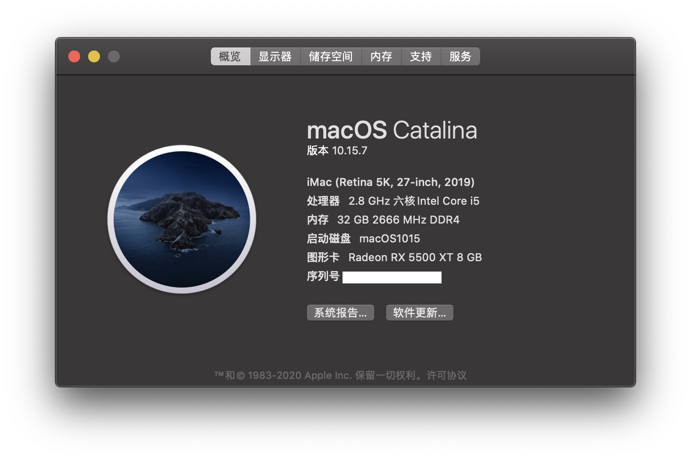

# TUF-B360M-Hackintosh

## Build : OpenCore 0.6.3, Catalina 10.15.7.

## Hardware Infomation

- Motherboard: ASUS TUF B360M-PLUS GAMING S
- CPU: Intel Core i5 8400
- GPU: GIGABYTE Radeon RX 5500 XT GAMING OC 8G
- Wifi Card: BCM94352Z (DW1560)
- SSD: WD SN750

## Working

- CPU Powermanagement
- WLAN / Bluetooth
- Airdrop / Handoff
- Sleep
- Hibernation (with hibernatemode 25)

## Attention

1. Kexts under ``LE Kexts`` should be installed to /Library/Extensions, and rebuild kextcache.

2. USB port Customization may not contain the Type-C port due to my laziness.

3. There are some performance patches for RX 5500 XT: [link](https://www.tonymacx86.com/threads/amd-radeon-performance-enhanced-ssdt.296555/)
   1. ``OC/ACPI/SSDT-RX5500XT-V10.aml``
   2. ``OC/Kexts/DAGPM.kext``
   3. ``config.plist/ACPI/Patch/0``
   4. **If you have other graphic card, please remove them!!**

4. **Platform Information has been removed. Please fill it by yourself.**

5. OC/Kexts/USBInjectAll.kext is left for debugging, disabled in config.plist

   